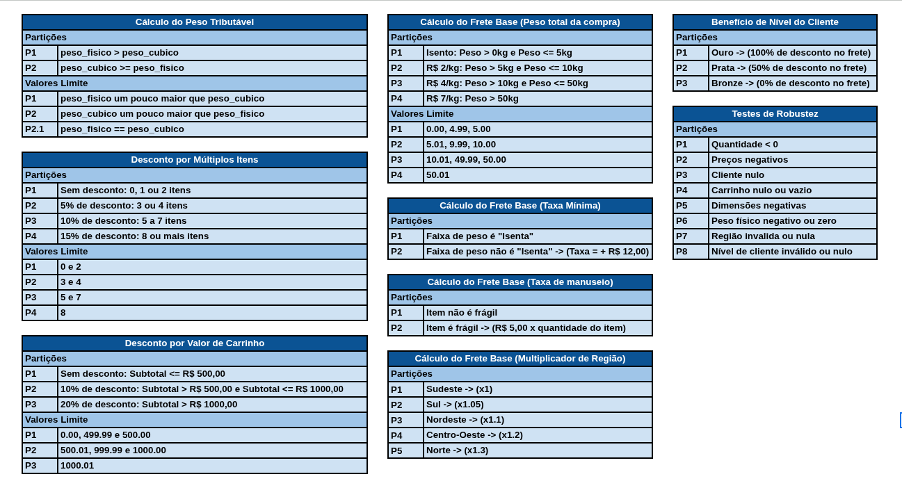

# Projeto: JoséCarlos-LucasEmanuel

Funcionalidade: Finalização de Compra

Este projeto implementa e testa a funcionalidade de cálculo do custo total da 
compra (CompraService.calcularCustoTotal) de forma isolada, utilizando Java 17, JUnit 5 e AssertJ.

Autores
- José Carlos da Silva
- Lucas Emanuel Ribeiro Costa

## Descrição da Funcionalidade

A funcionalidade de finalização de compra calcula o preço total considerando:

- Subtotal dos produtos.
- Descontos por quantidade de itens do mesmo tipo.
- Desconto por valor total da compra (>500 ou >1000).
- Cálculo de frete baseado em faixas de peso e região.
- Taxa adicional para produtos frágeis.
- Descontos de fidelidade (Ouro, Prata, Bronze).
- Arredondamento final para duas casas decimais (Half-up).

## Partições de domínio e valores limites do domínio

## Tabelas de decisão

## Instruções de Execução Pré-requisitos

- Java 17+
- Maven 3.8+
- JUnit 5
- AssertJ
- Jacoco (para cobertura)

### Executar os testes
<pre> mvn clean test </pre>

### Gerar relatório de cobertura
<pre>mvn jacoco:report</pre>

### O relatório ficará disponível em:
target/site/jacoco/index.html

